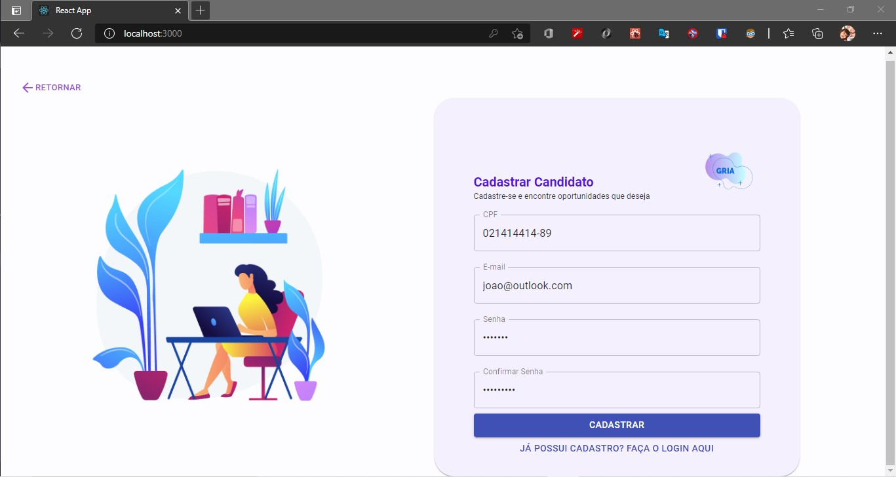
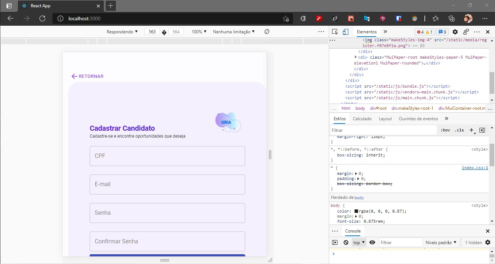
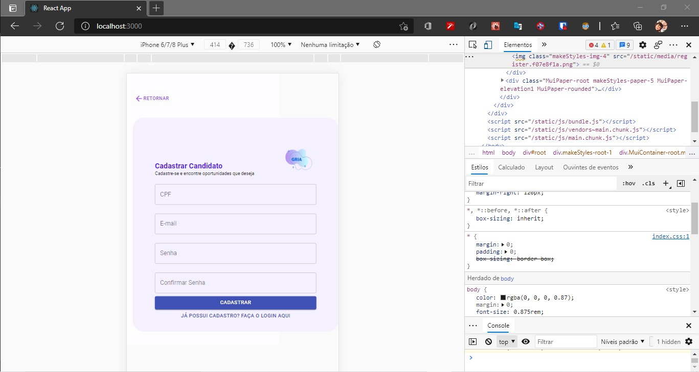

# GRIA Front-End User Login Page

## Tools Used:

- ReactJS
- Material-UI

## Screenshots






## Run

```
git clone https://github.com/crislerwin/gria-screens.git
cd gria-screens
npm install
npm start
```
